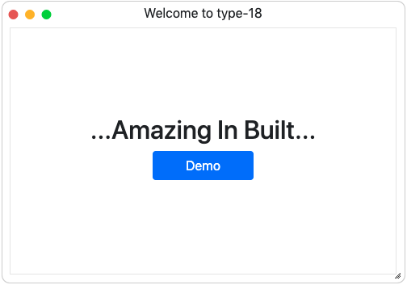

# PopupWindow

##### [back to contents](../../README.md#top)

## description

`PopupWindow` is a util class for client side to popup a window interface.



## usage

```js
import { PopupWindow } from "cicero/lib/client";

const bodyHTML = `
  <div style="height: 100%; width: 100%; display: flex; flex-flow: row wrap; justify-content: center; overflow: hidden;">
    <div style="align-self:center;">
      <h2 style="text-align:center;">...Amazing In Built...</h2>
      <div style="text-align:center;">
        <button class="btn btn-primary">Demo</button>
      </div>
    </div>
  </div>
`;
const popup = new PopupWindow({ title: "Welcome to type-18", bodyHTML });
```

## API

### constructor

<table>
  <thead>
    <tr>
      <th>Constructor</th>
      <th>Description</th>
    </tr>
  </thead>
  <tbody>
    <tr>
      <td><b>new PopupWindow(options: object)</b></td>
      <td><b>create a `PopupWindow` with init options</b></td>
    </tr>
  </tbody>
</table>

#### options

<table>
  <thead>
    <tr>
      <th>Option</th>
      <th>Type</th>
      <th>Default</th>
      <th>Descriptiong</th>
    </tr>
  </thead>
  <tbody>
    <tr>
      <td><b>windowStyle</b></td>
      <td><b>object</b></td>
      <td><b><code>undefined</code></b></td>
      <td><b>set the style of outer box of window, whose class is <code>cicero-popup-window</code></b></td>
    </tr>
      <tr>
      <td><b>windowTitleStyle</b></td>
      <td><b>object</b></td>
      <td><b><code>
        {  height: "20px", textAlign: "center" }
      </code></b></td>
      <td><b>set the style of window title, whose class is <code>cicero-popup-window-title</code></b></td>
    </tr>
    <tr>
      <td><b>windowBodyStyle</b></td>
      <td><b>object</b></td>
      <td><b><code>{
        height: "100%",
        margin: "10px",
        border: "0.5px solid rgba(0, 0, 0, 0.1)",
      }</code></b></td>
      <td><b>set the style of window body, whose class is <code>cicero-popup-window-body</code></b></td>
    </tr>
    <tr>
      <td><b>windowMaxStyle</b></td>
      <td><b>object</b></td>
      <td><b><code>
        {
          width: "700px",
          height: "550px",
          marginLeft: "-350px",
          marginTop: "-275px"
        }
      </code></b></td>
      <td><b>set the style of window if maxmize clicked</b></td>
    </tr>
    <tr>
      <td><b>windowMinStyle</b></td>
      <td><b>object</b></td>
      <td><b><code>
        {
          width: "200px",
          height: "40px",
          position: "fixed",
          bottom: "0",
          right: "0",
          marginLeft: "unset",
          marginTop: "unset",
          top: "unset",
          left: "unset"
        }
      </code></b></td>
      <td><b>set the style of window if minimize clicked</b></td>
    </tr>
    <tr>
      <td><b>title</b></td>
      <td><b>string</b></td>
      <td><b><code>""</code></b></td>
      <td><b>set the title of window</b></td>
    </tr>
    <tr>
      <td><b>bodyHTML</b></td>
      <td><b>string</b></td>
      <td><b><code>""</code></b></td>
      <td><b>set the innerHTML of window</b></td>
    </tr>
    <tr>
      <td><b>events</b></td>
      <td><b>object</b></td>
      <td><b><code>{}</code></b></td>
      <td><b>set the events handler to tackle window events, including <code>beforeOpen, afterOpen, beforeClose, afterClose, beforeMinimize, afterMinimize, beforeMaximize, afterMaximize</code></b></td>
    </tr>
    <tr>
      <td><b>draggableOptions</b></td>
      <td><b>object</b></td>
      <td><b><code>{}</code></b></td>
      <td><b>set the jquery-ui draggable widget options, see <a href="https://jqueryui.com/draggable/">draggable</a></b></td>
    </tr>
    <tr>
      <td><b>resizableOptions</b></td>
      <td><b>object</b></td>
      <td><b><code>{
        handles: "n, e, s, w, se, sw",
        minHeight: 40,
        minWidth: 200,
        maxHeight: 450,
        maxWidth: 600
      }</code></b></td>
      <td><b>set the jquery-ui resizable widget options, see <a href="https://jqueryui.com/resizable/">resizable</a></b></td>
    </tr>
  </tbody>
</table>

### methods

<table>
  <thead>
    <tr>
      <th>Return</th>
      <th>Method</th>
      <th>Description</th>
    </tr>
  </thead>
  <tbody>
    <tr>
      <td><b>undefined</b></td>
      <td><b>open()</b></td>
      <td><b>open the popup window</b></td>
    </tr>
    <tr>
      <td><b>undefined</b></td>
      <td><b>isOpen()</b></td>
      <td><b>check if the popup window is opened</b></td>
    </tr>
    <tr>
      <td><b>undefined</b></td>
      <td><b>close()</b></td>
      <td><b>close the popup window if opened</b></td>
    </tr>
    <tr>
      <td><b>undefined</b></td>
      <td><b>minimize()</b></td>
      <td><b>minimize the window with the windowMinStyle</b></td>
    </tr>
    <tr>
      <td><b>undefined</b></td>
      <td><b>maximize()</b></td>
      <td><b>maximize the window with the windowMaxStyle</b></td>
    </tr>
    <tr>
      <td><b>object</b></td>
      <td><b>getWindow()</b></td>
      <td><b>get the outside wrapper element of this popup-window</b></td>
    </tr>
    <tr>
      <td><b>object</b></td>
      <td><b>getWindowTitle()</b></td>
      <td><b>get window title element</b></td>
    </tr>
    <tr>
      <td><b>object</b></td>
      <td><b>getWindowBody()</b></td>
      <td><b>get window body element</b></td>
    </tr>
    <tr>
      <td><b>object</b></td>
      <td><b>getMinBtn()</b></td>
      <td><b>get the minimize button element</b></td>
    </tr>
    <tr>
      <td><b>object</b></td>
      <td><b>getMaxBtn()</b></td>
      <td><b>get the maximize button element</b></td>
    </tr>
    <tr>
      <td><b>object</b></td>
      <td><b>getCloseBtn()</b></td>
      <td><b>get the close button element</b></td>
    </tr>
  </tbody>
</table>
